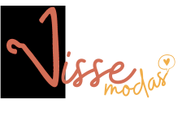

<h1 align="center">
</h1>

O projeto elaborado e desenvolvido por mulheres para o TCC da Academia de Capacitação Java e Angular.
O VisseModas é um sistema desenvolvido para compras, com o objetivo de automatizar a tarefa de cadastrar clientes, produtos e registrar pedidos.
Ao utilizar esta API, deve ser possível criar informações da compra, bem como listar, alterar ou excluir tais informações.

## Como instalar e rodar? 🚀
### Backend
- Entre no projeto backend/vissemodas
- Faça download das dependências utilizando a ferramenta **Maven**
- Faça a criação manual do banco de dados e configure o **nome do banco**, **usuário** e **senha** no arquivo *src/resources/application.properties.example* e mude o nome do arquivo para ***application.properties***
- Entre e rode o arquivo **src/main/java/VisseModasApplication**
- Acesse http://localhost:8080/swagger-ui.html#/ para utilizar a ferramenta **Swagger**, no qual você conseguirá dar um overview nos principais métodos e rotas da aplicação

### Frontend
- Entre no projeto frontend/vissemodas
- Faça download das dependências utilizando o comando ```npm install```
- Rode o comando no terminal ```ng serve```
- Navegue para http://localhost:4200/<br>
*A aplicação vai atualizar automaticamente se você alterar qualquer um dos arquivos de origem*

## Utilização 🖥️

Para utilizar este sistema localmente, é necessário instalar e configurar um SGBD, como o [MySQL](https://www.mysql.com/downloads/).


## Rotas
Depois de seguir os passos para rodar o projeto, acesse http://localhost:8080/swagger-ui.html#/ para utilizar a ferramenta **Swagger**, no qual você conseguirá dar um overview nos principais métodos e rotas da aplicação

## Tecnologias utilizadas 📱
- Spring
- Maven
- JPA/Hibernate
- Rest com JSON
- Angular
- JUnit

## Desenvolvedoras do projeto
- [Amanda Medeiros](https://www.linkedin.com/in/medeirosamandas)
- [Ambrósia Andrade](https://www.linkedin.com/in/ambrosiaandrade/)
- [Luana Bezerra](https://www.linkedin.com/in/luana-bezerradev/)
- [Maressa Oliveira](https://www.linkedin.com/in/maressavo/)
- [Rebeca Lira](https://www.linkedin.com/in/rebeca-lira-a7a262b9/)
- [Valquiria Matter ](https://www.linkedin.com/in/valquiria-matter-3988531a5/)
    
## Licence
MIT
